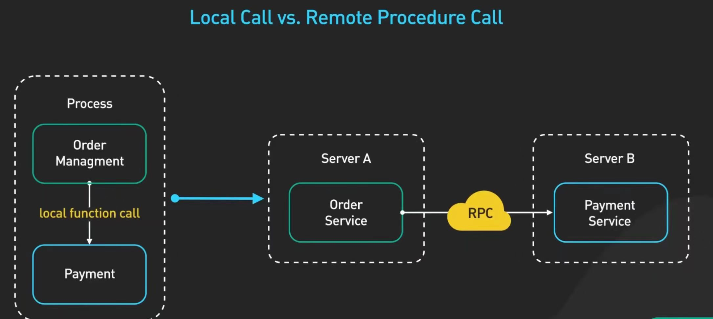
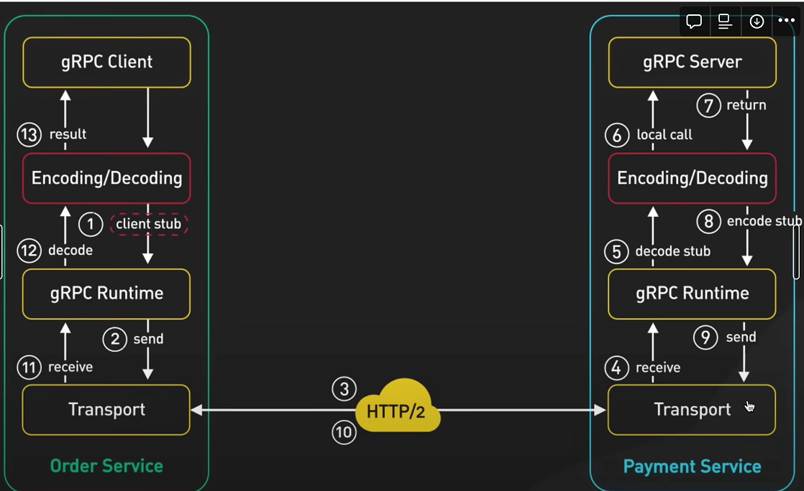

# RPC
### 什么是RPC
问题引入：
- socket编程
  - 网络协议层
    - TCP协议
      - http
      - RPC
    - UDP协议

纯TCP的链接的链接是怎么样的？存在什么问题

TCP在建立链接后，传输的是无边界的二进制流，裸连TCP可能存在“粘包”的情况。
因此引入了http协议，定义了数据包的header和body。

随着微服务架构的兴起，越来越需要在不同服务间进行类似于本地方法调用的跨服务方法调用，于是RPC逐渐兴起。

### http和RPC应用场景
- http:B/S架构
- RPC:C/S架构

### 完整RPC的流程
#### RPC在实现过程中，需要解决哪些问题？
- 函数映射问题：不同服务间如何建立服务函数的映射
- 网络传输问题：不同服务间如何进行通信

- 函数映射：通过静态代理的方式实现。
  - 被调用端声明IDL文件
  - IDL文件经过编译，在调用端中生成静态库，实现函数映射
- 网络传输：通过TCP相关协议实现，如GRPC使用了http2.0
- 序列转换：通过TCP相关协议传输的是二进制的数据，经过序列化和反序列化实现数据到实体的映射