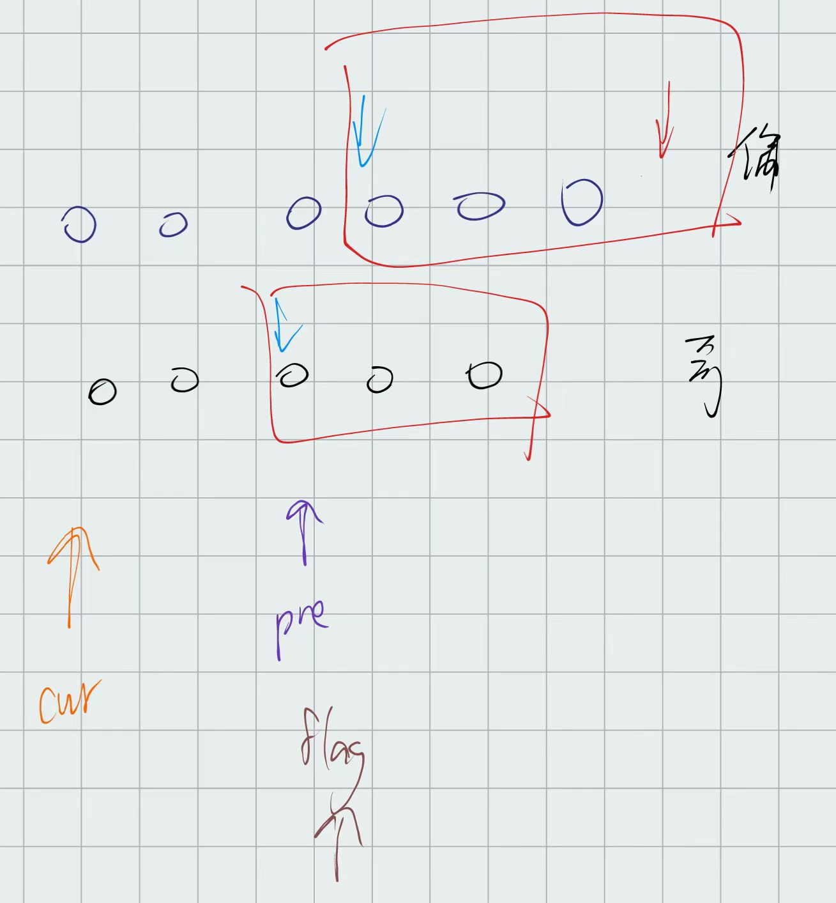

# 回文链表
# 题目描述
给你一个单链表的头节点 head ，请你判断该链表是否为
回文链表
。如果是，返回 true ；否则，返回 false 。

### 思路
- 转数组双指针
遍历链表，并将其转换为数组，使用双指针依次判断是否出现不一致的情况

```java
/**
 * Definition for singly-linked list.
 * public class ListNode {
 *     int val;
 *     ListNode next;
 *     ListNode() {}
 *     ListNode(int val) { this.val = val; }
 *     ListNode(int val, ListNode next) { this.val = val; this.next = next; }
 * }
 */
class Solution {
    public boolean isPalindrome(ListNode head) {
        ArrayList<Integer> tempList = new ArrayList<>();
        while(head != null){
            tempList.add(head.val);
            head = head.next;
        }
        int left = 0,right = tempList.size() - 1;

        while(left < right){
            // 终止条件
            if(tempList.get(left) != tempList.get(right)){
                return false;
            }
            left++;
            right--;
        }
        return true;
    }
}
```
- 反转链表 判断

```java
public boolean isPalindrome(ListNode head) {
        ListNode slow = head, fast = head, pre = head;
        ListNode cur = head;

        while(true){
            if(fast == null || fast.next == null){
                break;
            }
            fast = fast.next.next;
            slow = slow.next;

            if(pre.next != slow){    // 跳过第一次
                pre = pre.next;
            }else{
                continue;
            }
        }

        // 此时slow指向中间（奇数）|| 指向中间偏右（偶数）  pre指向slow前一个
        pre.next = reverseListNode(slow);
        pre = pre.next;
        ListNode flag = pre;

        // 回文判断
        while(cur != flag){
            if(cur.val != pre.val){
                return false;
            }
            cur = cur.next;
            pre = pre.next;
        }

        return true;
    }

    public ListNode reverseListNode(ListNode head){
        ListNode pre = null;
        ListNode cur = head;
        ListNode next;

        while(cur != null){
            next = cur.next;
            cur.next = pre;
            pre = cur;
            cur = next;
        }

        return pre;
    }
```

