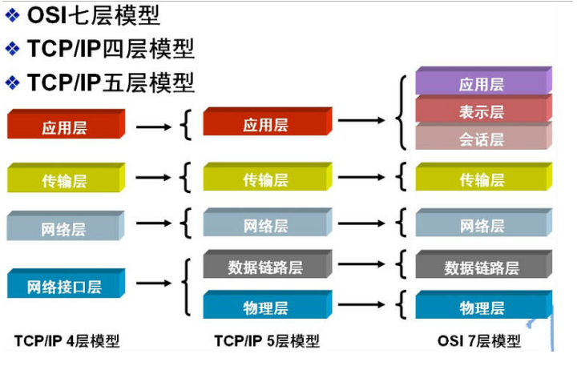

### 计算机网络层级 八股文
- 物理层：关键的两个概念是**消息的转发**和**标识**。传统的级联方式是两两间相连，但是
这种方式会随着结点的增多而导致物理连接的数量是指数级增长的。一个优化的解决方案是通过Hub集
线器作为数据传输的中转站，解决了连接数过大的问题。但是在这种层级中，数据的传输是采用
半双工的方式，传输的效率是没有那么高的。同时，数据进行传输的过程是采用广播的形式，不能
保证数据的安全性。在并行传输数据的场景下，也存在着数据不一致的现象，可采用链路监听技
术来解决。

`可改进的表述`:

1、物理层主要负责传输原始比特流，这包括数据的物理连接、数据传输方式（如电信号、光信号等）、物理接口的特性等。你提到的“消息的转发”和“标识”并不是物理层的直接职责，这些通常属于更高层次的功能，例如链路层或网络层的功能。

2、使用集线器（Hub）可以减少物理连接的复杂性，但集线器本身只是一个信号放大器，它会将接收到的信号广播到所有的端口，这确实如你所说，会降低传输的安全性。

3、你提到物理层使用半双工方式，这需要根据具体的物理介质和设备而定。物理层可以支持半双工、全双工或简单x的传输方式。

4、你提到的链路监听技术可以用于监控和管理数据传输，这通常是数据链路层的职责，如以太网中的碰撞检测和CSMA/CD协议。物理层本身不处理这些高级功能。

 
- 数据链路层：在数据链路层中，每个网络设备通过唯一的mac地址来进行标识（纠正：物理寻址）。设备通过与sw交换机进行连接，在sw交换机内部会维护一张mac:端口
表用以记录设备间的映射关系，从而增加数据传输的效率和安全性。在初次建立映射时，网络设备通过广播-目标设备标识的方式建立索引记录，并将
该条记录存放在mac:端口（可简述：Mac表）的表中，下次再进行数据间传输则现在表中查询，若存在映射则可直接使用。sw交换机还可采用级联桥接的方式，拓展设备的
连接数量。总的来说，sw交换机可应用于构建小规模的网络系统，但随着需要连接的网络设备的增加，会导致“消息洪荒”现象，降低网络设备间数据传输
的效率。

追问问题：什么是“消息洪荒”？（纠正：广播风暴）

sw交换机中可存放的mac:端口映射是有限的，也就是说，当表中存放的映射数目到达上限时，会进行删除的操作。如果连接交换机的网络设备较多的话，
可能会导致同一条映射多次采用全局广播的形式来建立索引。与此同时，需要连接的网络设备较多的话，可能需要通过交换机级联桥接的方式进行拓展，
这也会导致传输过程中进行多个交换机的中转，这不仅增加了延迟还降低传输效率。结合两者，导致随着连接设备的增多而导致数据传输的性能也随之降低。

`可改进的表述`：

“消息洪荒”：这个表述不是网络领域的标准术语。建议使用 “广播风暴” (Broadcast Storm) 这个更为标准的术语来描述网络中由于过度广播导致的拥堵和性能问题。

“sw交换机”：通常不需要在“交换机”前添加“sw”作为缩写。简单使用 “交换机” 或者英文中的 “Switch” 即可。

“消息的转发”（在之前关于物理层的讨论中提到）：更标准的表述应是 “数据传输” 或 “信号转发”，因为“消息”的概念通常用于更高层的协议。

“标识”（同样在物理层的讨论中）：此处应明确是指 “物理寻址” 或者更具体地，指 “MAC寻址”，如果是在数据链路层的语境下。

“通过与sw交换机进行连接”：建议改为 “通过连接到交换机”，以避免重复和简化表述。

“mac:端口表”：虽然描述正确，但标准的表述是 “MAC地址表” 或 “MAC表”。
- 网络层：在数据链路层我们通过了交换机来满足小规模局域网的互联互通，但是互联网的目的是实现跨局域网的全球互联互通，连通两个网络成了需
要解决的问题。这个时候引入了网关，又称路由器。在不同的网络间，我们需要通过Ip来进行通信，Ip地址主要用于标识网络和设备，通过路由器
这个“中间人”实现在网络层面的数据通信。当找到了对应网络的端口后，通过ARP网络协议，再将Ip地址映射到mac地址，以便在局域网中正确地找到目
标传输设备。

`可改进的部分：`

网关和路由器：虽然“网关”这一术语在一定情境下可与“路由器”互换，但在严格意义上，网关是一个更为广泛的概念，用于连接两个不同的网络，可能涉及不同协议的转换。而路由器专指在网络层使用IP地址来转发数据包的设备。建议明确使用 “路由器” 来描述负责IP数据包转发的设备。

IP地址的用途：你正确地指出了IP地址用于标识网络和设备。更准确地说，IP地址包含网络部分和主机部分，用于在全球范围内唯一定位一个网络接口。

数据通信的中间人：描述路由器作为“中间人”在技术文档中可能稍显非正式。建议使用 “中介设备” 或 “数据转发设备” 等更专业的表述。

ARP网络协议：你提到使用ARP协议将IP地址映射到MAC地址，这是正确的。不过，建议强调这一过程主要发生在同一局域网内，即ARP主要用于在已知IP地址的情况下，找出目标设备的物理地址（MAC地址）以完成数据包的传输。

数据包的传输：你的描述暗示了路由器在发现目标网络后通过ARP来寻找具体设备，实际上路由器的工作主要是根据IP路由表来确定下一跳路由器或最终目的地，而ARP的使用主要是在最终数据包达到目的子网，由最后一个路由器找到具体设备时发生的。

### tcp/ip 网络模型在第几层

### 如何计算带宽
1. 基本带宽计算公式
   带宽 = 数据量 / 时间

其中：

带宽的单位可以是比特每秒 (bps)、千比特每秒 (Kbps)、兆比特每秒 (Mbps)、吉比特每秒 (Gbps) 等。
数据量的单位可以是比特 (bits)、字节 (bytes)、千字节 (KB)、兆字节 (MB)、吉字节 (GB) 等。
时间的单位通常是秒 (seconds)。

mb/s 和 MB/s 是两种常见的带宽或数据传输速率单位，它们之间存在显著差异，因为它们使用不同的基本单位。

mb/s 表示 兆比特每秒 (megabits per second)。
MB/s 表示 兆字节每秒 (megabytes per second)。
1 字节 (B) = 8 比特 (b)

因此，MB/s 和 mb/s 之间的换算关系如下：

1
`mb/s` 和 `MB/s` 是两种常见的带宽或数据传输速率单位，它们之间存在显著差异，因为它们使用不同的基本单位。

- `mb/s` 表示 **兆比特每秒 (megabits per second)**。
- `MB/s` 表示 **兆字节每秒 (megabytes per second)**。

1 字节 (B) = 8 比特 (b)

因此，`MB/s` 和 `mb/s` 之间的换算关系如下：

\[ 1 \text{ MB/s} = 8 \text{ mb/s} \]

\[ 1 \text{ mb/s} = \frac{1}{8} \text{ MB/s} \]

### 换算示例

1. **将 MB/s 转换为 mb/s**：
   - 如果带宽是 10 MB/s，那么转换为 mb/s 为：
     \[ 10 \text{ MB/s} \times 8 = 80 \text{ mb/s} \]

2. **将 mb/s 转换为 MB/s**：
   - 如果带宽是 80 mb/s，那么转换为 MB/s 为：
     \[ 80 \text{ mb/s} \div 8 = 10 \text{ MB/s} \]

### 总结

- **MB/s 到 mb/s**：
  \[ x \text{ MB/s} \times 8 = y \text{ mb/s} \]

- **mb/s 到 MB/s**：
  \[ x \text{ mb/s} \div 8 = y \text{ MB/s} \]

### 具体示例

假设你有以下带宽，需要进行换算：

1. **20 MB/s 转换为 mb/s**：
   \[ 20 \text{ MB/s} \times 8 = 160 \text{ mb/s} \]

2. **160 mb/s 转换为 MB/s**：
   \[ 160 \text{ mb/s} \div 8 = 20 \text{ MB/s} \]

通过上述公式和示例，你可以轻松地在 `MB/s` 和 `mb/s` 之间进行单位换算。